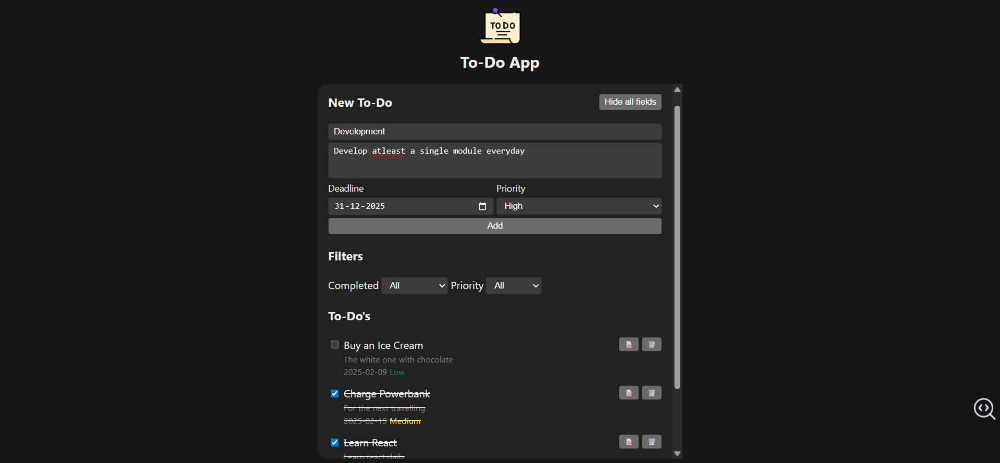
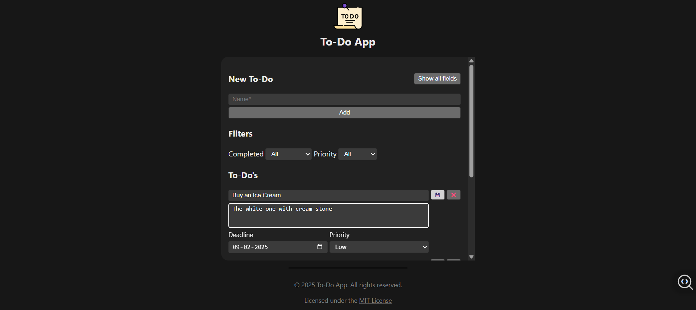
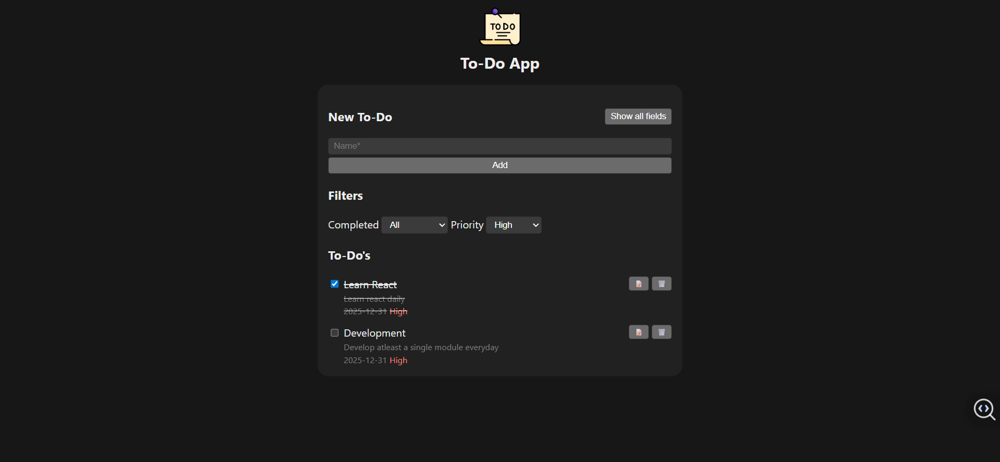

# React Todo App

A modern Todo application built with React that allows users to add, edit, delete, and filter tasks. The app features form validation, API integration, and a clean, modular component architecture.

## Project Overview

This Todo App is designed as a full-featured task manager implemented using React for the frontend with state managed by React hooks and a custom hook for todos logic. The app communicates with a backend API for persistent storage and CRUD operations on todo items. It emphasizes user experience with loading indicators, error alerts, and form validation.

## Features

- Add new todo items with optional description, deadline, and priority.

- Edit existing todos with inline editing forms.

- Mark todos as completed or active.
- Delete todos permanently.
- Filter todos by completion status and priority levels.

- Form input validation with helpful error messages.
- Responsive and accessible UI.

## Technologies Used

- React 18 with functional components and hooks
- React Hook Form for form handling
- Yup for schema-based form validation
- Axios for RESTful API communication
- CSS Modules for scoped styling
- JSON Server or similar mock API backend (configured via environment variable)

## Getting Started

### Prerequisites

- Node.js (version 16 or later recommended)
- npm or yarn package manager

### Installation

Clone the repository:

git clone https://github.com/Yaswanthpatnam/Todo-app.git
cd Todo-app

### Environment Setup

Create an `.env` file in the root with this content, updating the API URL as needed:

VITE_MOCKAPI_BASE_URL=https://your.api.endpoint/

### Running the App

Start the development server:

npm run dev
or
yarn dev

Open http://localhost:5173 (or the displayed port) in your browser.

## License

This project is licensed under the MIT License.
